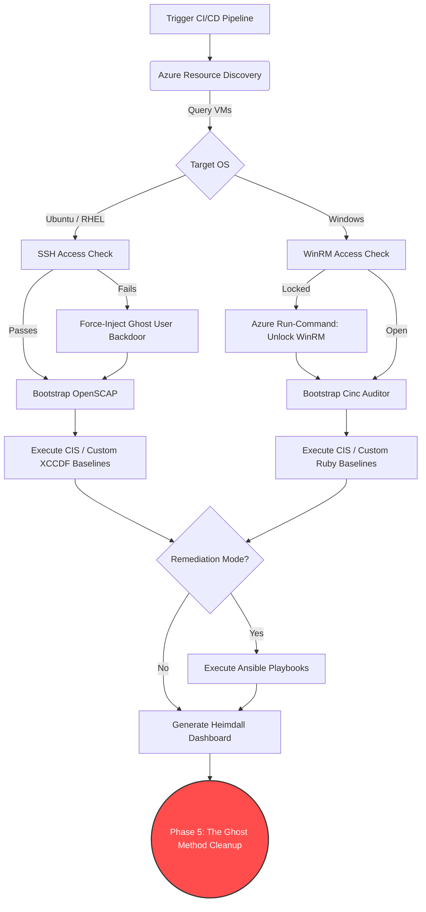

# 🛡️ Fleet Commander
**Enterprise Multi-OS DevSecOps Compliance Orchestrator**

> A zero-trust CI/CD pipeline designed to automatically discover, audit, and remediate virtual machine fleets (Ubuntu, RHEL, Windows) hosted in Microsoft Azure.

---

## 📖 Overview

**Fleet Commander** bridges the gap between infrastructure management and continuous compliance. Designed for dynamic cloud environments, it utilizes a unique **"Ghost User" auto-healing architecture** to bypass locked-down SSH or broken WinRM configurations. It automatically injects Just-In-Time (JIT) credentials, runs standard Center for Internet Security (CIS) or custom organizational baselines, applies Ansible remediations, and permanently covers its tracks.

## ✨ Core Features

* 🧠 **Dynamic Azure Discovery:** Automatically queries Azure Resource Groups by Environment Tags to build real-time inventory lists of running nodes.
* 💉 **JIT Auto-Healing:** Temporarily injects a privileged "Ghost User" to bypass broken cloud-init locks, fixing SELinux/Crypto policies on the fly.
* 📊 **Multi-OS Scanning:** Natively routes Linux targets to **OpenSCAP** and Windows targets to **Cinc Auditor**.
* 🛠️ **Automated Remediation:** Deploys targeted Ansible playbooks and OpenSCAP routines to instantly fix failing compliance controls.
* 🧹 **Zero-Trust Cleanup:** Safely removes temporary NSG firewall rules, uninstalls scanner dependencies, and completely deletes injected users to secure the environment post-audit.

---

## 🗺️ Pipeline Architecture

🚀 Getting Started
1. Prerequisites
Ensure the machine or CI/CD runner executing this orchestrator has the following tools installed:

az (Azure CLI) - Authenticated with your service principal.

ansible - For remediation routing.

cinc-auditor (or Chef InSpec) - For Windows compliance scanning.

python3 - For extracting legacy SCAP packages.

2. Configuration (.env)
Fleet Commander is completely dynamic. For local testing, copy the .env.example file to .env and add your target infrastructure variables. (Note: Never commit your .env file to version control).

Code snippet
# --- Azure Infrastructure ---
AZURE_RG_NAME="YOUR_RESOURCE_GROUP"
AZURE_KV_NAME="YOUR_KEYVAULT_NAME"
AZURE_KV_SECRET="WindowsAdminPasswordSecretName"

# --- Organization Customization ---
ORG_NAME="MyCorp"
ORG_PREFIX="custom"
GHOST_USER="audit_ghost"
CUSTOM_XCCDF_PROFILE="xccdf_com.mycorp_profile_lsb"

# --- Default Fallback Admins ---
LINUX_ADMIN_USER="ubuntu"
WINDOWS_ADMIN_USER="Windows_Admin"
3. Directory Structure
Populate the corresponding directories with your organization's custom SCAP (XCCDF/OVAL) XML files, InSpec Ruby benchmarks, and Ansible Playbooks:

Plaintext
├── multi_os_benchmark.sh        # Core Orchestrator
├── ubuntu-custom/               # Custom Ubuntu Rules
├── rhel-custom/                 # Custom RHEL Rules
├── window-custom/               # Custom Windows Rules
└── window-default-cis/          # Standard Windows CIS Rules
💻 Execution Methods
Option A: Interactive Mode (Local)
Run the script without arguments to launch the interactive terminal GUI. Ideal for local testing and manual execution.

Bash
chmod +x multi_os_benchmark.sh
./multi_os_benchmark.sh
Option B: Headless Mode (CI/CD Pipeline)
Pass parameters to fully automate the pipeline in GitHub Actions, GitLab CI, or Jenkins.

Syntax:

Bash
./multi_os_benchmark.sh --headless --profile <custom|cis|both> --mode <scan|remediate|full> --targets <Tag|all>
Example 1: Full Audit on 'Prod' Tag

Bash
./multi_os_benchmark.sh --headless --profile both --mode scan --targets Prod
Example 2: CIS Level 1 Scan & Fix on All VMs (with cleanup)

Bash
export CIS_LEVEL="Level 1"
./multi_os_benchmark.sh --headless --profile cis --mode full --targets all --cleanup true
