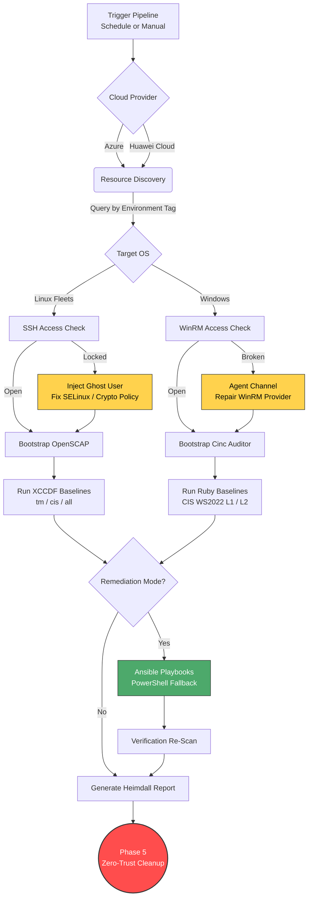

<div align="center">

# 🛡️ Cloud Compliance Auditor
**Enterprise Multi-OS DevSecOps Compliance Orchestrator**

[](#)
[](#)
[](#)
[](#)
[](#)
[](#)
[](#)

> A zero-trust CI/CD pipeline that automatically discovers, audits, remediates, verifies, and reports on virtual machine fleets (Ubuntu, RHEL, Rocky, AlmaLinux, Windows Server) running in Microsoft Azure and Huawei Cloud.

</div>

---

## 📖 Overview

**Cloud Compliance Auditor** closes the gap between infrastructure management and continuous compliance. It is built for dynamic cloud environments and uses a **"Ghost User" auto-healing architecture** to reach hosts even when SSH is locked down or Windows Remote Management is broken. In a single run it discovers the fleet, injects Just-In-Time (JIT) credentials only when access recovery is needed, scans against Center for Internet Security (CIS) or custom organisational baselines, applies remediation, runs a verification scan to prove the result, builds a Heimdall report, and then removes every temporary change so the environment returns to a clean state.

The same pipeline runs on **Azure** and **Huawei Cloud** through a small provider abstraction layer, so the cloud is selected at run time without changing the logic.

## ✨ Core Features

* 🧠 **Dynamic Discovery:** Queries the cloud by Environment Tag to build a real-time inventory of running nodes, with no manual target lists.
* ☁️ **Cross-Cloud:** Runs on Microsoft Azure or Huawei Cloud through a provider abstraction layer, selected with a single flag.
* 💉 **JIT Auto-Healing:** Temporarily injects a privileged "Ghost User" through the cloud command channel to bypass broken cloud-init locks and fix SELinux or crypto policy on the fly.
* 📊 **Multi-OS Scanning:** Routes Linux targets to **OpenSCAP** and Windows targets to **Cinc Auditor** automatically.
* 🪟 **Full Windows CIS Profile:** Ships the CIS Windows Server 2022 v5.0.0 benchmark as a single InSpec profile (Level 1 and Level 2), with role-aware controls for member servers and domain controllers.
* 🛠️ **Dual Remediation:** Applies the ansible-lockdown CIS roles as the primary path, with a self-contained PowerShell script as a Windows fallback when the remote connection cannot be made.
* ✅ **Verification Re-Scan:** Re-scans after remediation so the before and after scores can be compared, not just asserted.
* 📈 **Heimdall Reporting:** Converts OpenSCAP and Cinc Auditor results into the MITRE SAF format so Linux and Windows results read side by side on one dashboard.
* 🧷 **Built-In Safety:** Opens firewall/NSG rules only from the runner address, checks host health before any reboot, bounds every remote call with a timeout so a single bad host cannot stall the run, and keeps the hardening while removing all temporary access.
* 🧹 **Zero-Trust Cleanup:** Removes temporary firewall rules, uninstalls scanner dependencies, and deletes the injected user after the audit.

---

## 🗺️ Pipeline Architecture



---

## 🧭 Compliance Profiles

Cloud Compliance Auditor supports three profile selections through the `--profile` flag.

| Profile | Meaning |
| :--- | :--- |
| `tm` | Custom TM organisational baseline only. |
| `cis` | Standard CIS benchmark only. |
| `all` | Custom TM baseline **and** the standard CIS benchmark, run together. |

> ⚠️ **Safety gate:** the CI workflow automatically forces `mode: scan` whenever `profile: all` is selected, regardless of what mode was requested. Mass remediation is never allowed to run against every profile at once — this is enforced in the pipeline, not just documented here.

For Windows, the CIS profile is the full **CIS Windows Server 2022 v5.0.0** benchmark held in one InSpec profile. Two inputs change its behaviour at scan time.

* **`profile_level`** selects Level 1 (the default baseline) or Level 2 (stricter, defence in depth). Set the level with the `CIS_LEVEL` environment variable, for example `Level 1` or `Level 2`.
* **`server_role`** selects `member_server` or `domain_controller`, so role-scoped controls skip on a host they do not apply to.

---

## 🚀 Quick Start Guide

### 1️⃣ Prerequisites

Make sure your runner or local machine has the following toolchain.

* ☁️ **`az`** Azure CLI, authenticated with your service principal (used when the provider is Azure).
* ☁️ **Huawei Cloud Python SDK** (`huaweicloudsdkcore`, `huaweicloudsdkecs`, `huaweicloudsdkvpc`), authenticated with an IAM AK/SK pair (used when the provider is Huawei Cloud). AK/SK signs each request locally against a private ECS endpoint — the `hcloud` CLI (KooCLI) is **not** used, since it resolves endpoints from its own public-region catalogue and cannot reach a private endpoint.
* ⚙️ **`ansible`** for routing remediation playbooks.
* 🔍 **`cinc-auditor`** or Chef InSpec for Windows compliance scanning.
* 📈 **`saf`** the MITRE SAF CLI for converting results into the Heimdall format.
* 🐍 **`python3`** for unpacking SCAP packages dynamically and for the Huawei Cloud SDK calls.

**Bootstrap Ansible dependencies.** Before running the orchestrator, install the third-party roles and collections from the requirements file.

```bash
ansible-galaxy collection install -r requirements.yml
ansible-galaxy role install -r requirements.yml
```

### 2️⃣ Configuration (`.env`)

Cloud Compliance Auditor is **100% dynamic**. For local testing, copy `.env.example` to `.env` and set your infrastructure variables.

> ⚠️ **SECURITY WARNING:** Never commit your `.env` file to version control. In GitHub Actions, provide these through **Repository Secrets and Variables** instead.

```env
# --- Cloud Provider (azure | huaweicloud) ---
CLOUD_PROVIDER="azure"

# --- Azure Infrastructure ---
AZURE_RG_NAME="YOUR_RESOURCE_GROUP"

# --- Huawei Cloud (used when CLOUD_PROVIDER=huaweicloud) ---
HW_REGION="my-kualalumpur-1"
HW_PROJECT_ID="YOUR_PROJECT_ID"
HW_ECS_ENDPOINT="https://ecs.my-kualalumpur-1.alphaedge.tmone.com.my"
HW_ECS_TAG_KEY="Environment"
HW_VPC_ID="YOUR_VPC_ID"
HW_EPS_ID=""

# --- Organization Customization ---
ORG_NAME="TM"
ORG_PREFIX="tm"
GHOST_USER="audit_ghost"
CUSTOM_XCCDF_PROFILE="xccdf_tm_profile_lsb"

# --- Default Fallback Admins ---
LINUX_ADMIN_USER="ubuntu"
WINDOWS_ADMIN_USER="Windows_Admin"
```

### 3️⃣ Directory Structure

The repository keeps organisational rules separate from the standard CIS content, and separates orchestration logic from cloud-specific discovery code.

```text
📦 Cloud-Compliance-Auditor
├── 📂 .github/workflows/                            # CI/CD pipeline (Cloud Compliance Auditor)
├── 📂 modules/                                      # Sourced by the orchestrator at runtime
│   ├── 📜 utils.sh                                  # Shared logging, SSH helpers (no cloud/OS logic)
│   ├── 📜 discovery_azure.sh                        # Azure VM discovery, NSG rules, run-command helpers
│   └── 📜 discovery_cae.sh                          # Huawei Cloud (CAE) discovery, SG rules, power state
├── 📂 scripts/                                      # Python helpers invoked by the modules above
│   ├── 📜 hw_ecs_discover.py                        # Huawei ECS discovery via SDK (AK/SK, private endpoint)
│   ├── 📜 hw_sg_rule_manage.py                      # Huawei security-group rule add/refresh
│   └── 📜 hw_verify_auth.py                         # Single source of truth for the Huawei SDK auth check
├── 📂 rhel-custom/                                  # Custom TM RHEL rules and playbooks
├── 📂 ubuntu-custom/                                # Custom TM Ubuntu rules and playbooks
├── 📂 windows-custom/                                # Custom TM Windows rules and playbooks
├── 📂 windows-default-cis/                           # Standard CIS Windows content
│   └── 📂 windows-baseline/
│       ├── 📜 inspec.yml                            # Profile metadata and inputs
│       ├── 📂 controls/
│       │   └── 📜 cis_ws2022_v5_0_0_benchmark.rb    # CIS WS2022 v5.0.0, 433 controls (L1 and L2)
│       └── 📜 Invoke-CISRemediation-Combined.ps1    # PowerShell remediation fallback
├── 📂 tests/                                        # Unit tests for scripts/*.py and control-file linting
├── 📜 azure_rm.yml                                  # Dynamic Ansible inventory (Azure)
├── 📜 universal_remediate.yml                       # Shared remediation playbook
├── 📜 multi_os_benchmark.sh                         # Core Bash orchestrator
├── 📜 audit_runner.sh                               # Per-host audit execution
├── 📜 requirements.yml                              # Ansible collections and roles
├── 📜 requirements.txt                              # Pinned Python dependencies
└── 📜 .env.example                                  # Configuration template
```

---

## 💻 Execution Methods

### 🕹️ Option A: Interactive Mode (Local)

Run the script without arguments to launch the interactive terminal menu. This is ideal for local testing and for running a single phase at a time.

```bash
chmod +x multi_os_benchmark.sh
./multi_os_benchmark.sh
```

### 🤖 Option B: Headless Mode (CI/CD Pipeline)

Pass parameters to automate the pipeline in GitHub Actions, GitLab CI, or Jenkins.

**Base syntax**
```bash
./multi_os_benchmark.sh --headless --cloud <azure|huaweicloud> --profile <tm|cis|all> --mode <scan|remediate|full> --targets <Tag|all>
```

**🎯 Example 1: Full audit on the Prod tag (Azure)**
```bash
./multi_os_benchmark.sh --headless --cloud azure --profile all --mode scan --targets Prod
```

**🎯 Example 2: CIS Level 1 scan and auto-fix with cleanup (Azure)**
```bash
export CIS_LEVEL="Level 1"
./multi_os_benchmark.sh --headless --cloud azure --profile cis --mode full --targets all --cleanup true
```

**🎯 Example 3: Scan a single Windows host on Huawei Cloud**
```bash
./multi_os_benchmark.sh --headless --cloud huaweicloud --profile cis --mode scan --target-os windows --targets Dev
```

---

## ⚙️ Command-Line Options

| Flag | Values | Description |
| :--- | :--- | :--- |
| `--headless` | none | Run without prompts, taking settings from the flags. |
| `--cloud` | `azure`, `huaweicloud` | Select the cloud provider (Azure is the default). |
| `--profile` | `tm`, `cis`, `all` | Select the baseline to apply. |
| `--mode` | `scan`, `remediate`, `full` | Select the action. `full` scans, fixes, then verifies. |
| `--targets` | `<Tag>`, `all` | Select the environment tag or the whole fleet. |
| `--target-os` | `ubuntu`, `rhel`, `rocky`, `alma`, `windows` | Limit the run to one operating system family. |
| `--target-ip` | `<address>` | Limit the run to a single host. |
| `--cleanup` | `true`, `false` | Remove temporary access and scanner tools after the run. |
| `--ticket` | `<id>` | Record a change request identifier with the run. |
| `--debug` | none | Produce verbose logs for troubleshooting. |

---

## 📈 Reporting

Linux and Windows results are kept in their own native formats rather than forced into one shared format:

| OS family | Scanner | Report format | How it's produced |
| :--- | :--- | :--- | :--- |
| Ubuntu, RHEL, Rocky, Alma | OpenSCAP | `.html` | OpenSCAP's built-in HTML report generator (`oscap xccdf generate report`) — no conversion step |
| Windows | Cinc Auditor | `.json` | Converted into the MITRE Heimdall/SAF format via `saf convert`, viewable in the **Heimdall** viewer |

Because Linux keeps OpenSCAP's own HTML report, it can be opened directly in a browser with no extra tooling. Because Windows results go through Heimdall, they get the same severity colours, pass/fail counts, and control-level detail that Heimdall provides for InSpec output. The before and after result files are kept for each run, so the verification scan can be compared against the first scan. In a pipeline run, the `.html` (Linux) and `.json` (Windows) artifacts are gathered into a single release, organised by host IP, so the evidence for a run can be found later by its run identifier regardless of which OS produced it.

---

## 🌐 Cross-Cloud Support

The provider is chosen with `--cloud`. Each provider-specific action sits behind a small wrapper (`modules/discovery_azure.sh`, `modules/discovery_cae.sh`), so the rest of the pipeline does not change between clouds.

* **Azure** uses the `az` CLI for discovery and NSG rules. SSH is now the primary access path for Windows as well as Linux, so both OS families are reached the same way on Azure.
* **Huawei Cloud** uses the official Python SDK (`huaweicloudsdkcore` + `huaweicloudsdkecs`) for discovery and security-group operations, signing requests locally with an AK/SK pair against a private ECS endpoint.

> **Windows access model.** Both clouds now use SSH as the primary path for Windows, matching the Linux flow. The difference is what happens when SSH is unreachable:
> - **Azure** falls back to `az vm run-command invoke` (`azure_vm_bootstrap_ssh`) — an out-of-band control-plane call that installs/starts OpenSSH Server and trusts the runner's key, without needing any existing remote-access session. This repair path only runs after `wait_for_ssh` has already failed; it is not used for routine scan/remediate calls.
> - **Huawei Cloud** has no equivalent out-of-band channel for Windows, so if SSH is unreachable there is no automated recovery — the runner's public key must already be trusted (baked into the image at creation time, same as Linux), and a broken SSH config requires manual intervention.
>
> This means Azure keeps a self-healing advantage over Huawei Cloud for Windows, even though day-to-day operation is identical (SSH) on both.

---

## 🔒 Safety and Zero-Trust Cleanup

Because the pipeline can change live servers, safety is built into it rather than added later.

* **Runner-scoped access.** Temporary firewall/NSG rules are opened only from the runner address, so the opening cannot be used from anywhere else while the audit runs.
* **Health-gated reboot.** The pipeline confirms a host is alive through the cloud agent before it reboots, so it never reboots a server that is already in trouble.
* **Bounded waits.** Every remote call is wrapped in a timeout, so a single slow or broken host cannot stall the whole run. A host that times out is recorded and skipped rather than retried forever.
* **Mass-change guard.** The CI workflow blocks wide remediation when every profile is selected at once, so a broad selection cannot trigger a broad change.
* **Always-on cleanup.** The cleanup phase runs even after a failure. It deletes the Ghost User, removes the temporary firewall rule, and uninstalls scanner dependencies, while keeping the hardening that was applied.

---

## 🔑 CI/CD Secrets and Variables

When running in GitHub Actions, provide the following through repository settings rather than the `.env` file.

**Secrets**

| Secret | Purpose |
| :--- | :--- |
| `AZURE_CLIENT_ID` | Azure service principal client ID. |
| `AZURE_CLIENT_SECRET` | Azure service principal client secret. |
| `AZURE_SUBSCRIPTION_ID` | Azure subscription ID. |
| `AZURE_TENANT_ID` | Azure tenant ID. |
| `HW_ACCESS_KEY` | Huawei Cloud IAM access key. |
| `HW_SECRET_KEY` | Huawei Cloud IAM secret key. |
| `UBUNTU_SSH_KEY` | Private SSH key used for Linux hosts (both clouds) and the Windows agent channel. |

**Variables**

| Variable | Purpose |
| :--- | :--- |
| `AZURE_RG_NAME` | Target Azure resource group. |
| `HW_REGION` | Huawei Cloud region (e.g. `my-kualalumpur-1`). |
| `HW_PROJECT_ID` | Huawei Cloud project identifier. |
| `HW_ECS_TAG_KEY` / `HW_ECS_TAG_VAL` | Optional tag key/value used to filter ECS discovery. |
| `HW_VPC_ID` | Huawei Cloud VPC used for security-group rules. |
| `HW_EPS_ID` | Optional Huawei Cloud enterprise project ID. |
| `HW_VPC_ENDPOINT` | Huawei Cloud VPC API endpoint (auto-derived from `HW_REGION` if unset). |
| `LINUX_ADMIN_USER` | SSH user for Linux targets. |
| `WIN_SSH_USER` | SSH user for Windows targets (default `Administrator`). |
| `WIN_SERVER_ROLE` | `member_server` or `domain_controller`. |
| `ORG_NAME`, `ORG_PREFIX` | Organisation name and prefix for custom content. |
| `GHOST_USER` | Name of the temporary JIT access-recovery account. |
| `CUSTOM_XCCDF_PROFILE` | XCCDF profile ID for the custom TM baseline. |

> `HW_CSMS_SECRET`, `AUDIT_PASS`, `AZURE_KV_NAME`, and `AZURE_KV_SECRET` are no longer used by this pipeline and should be removed from repository secrets/variables if still present. Windows access no longer depends on a stored password from Key Vault or a Cloud Secret Management Service lookup — both clouds now authenticate Windows over SSH, the same as Linux.

---

<div align="center">

*Engineered for continuous compliance and zero-trust automation across a cross-cloud, multi-OS fleet.*

</div>
